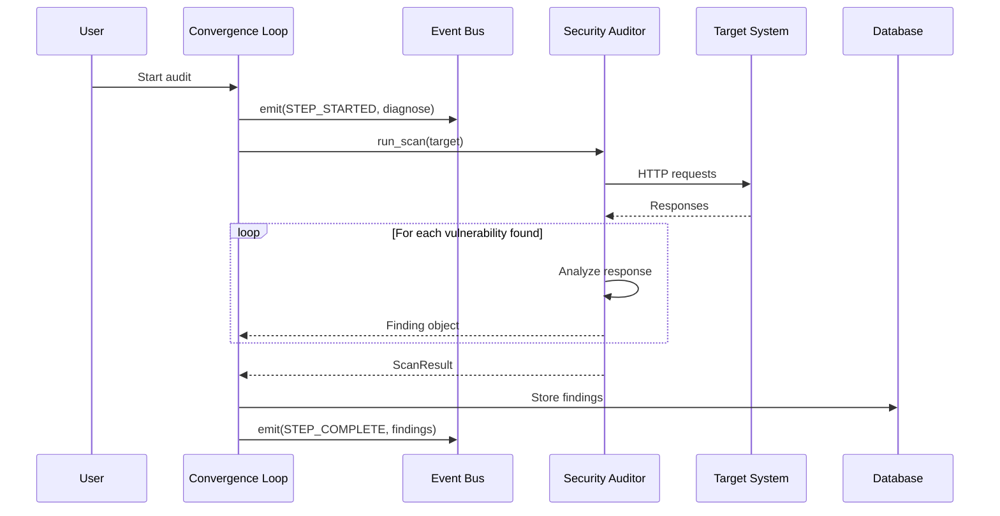
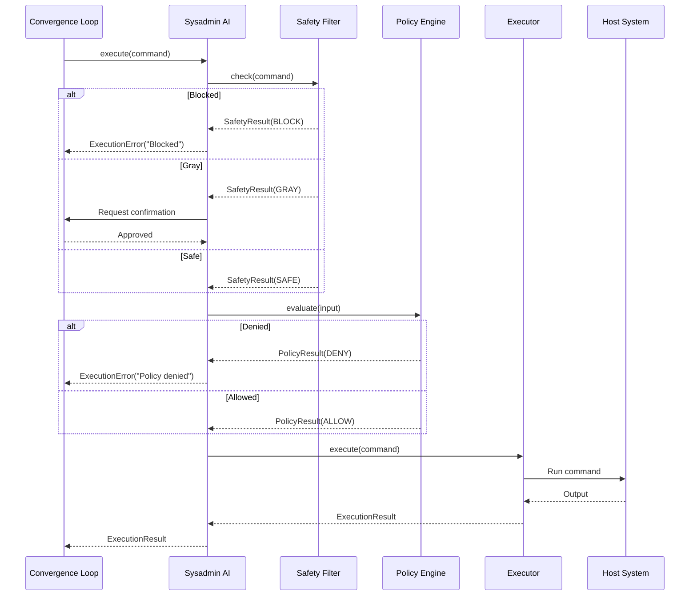
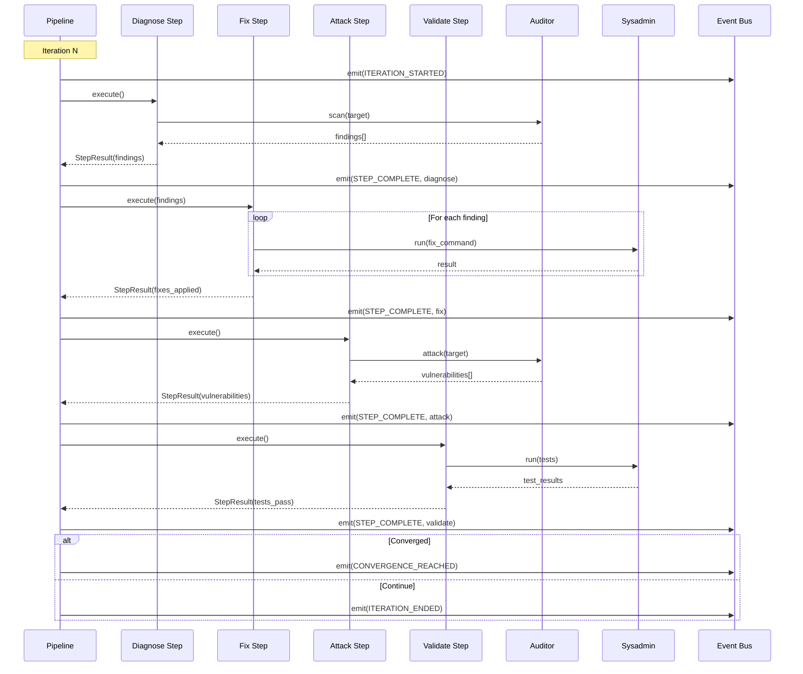
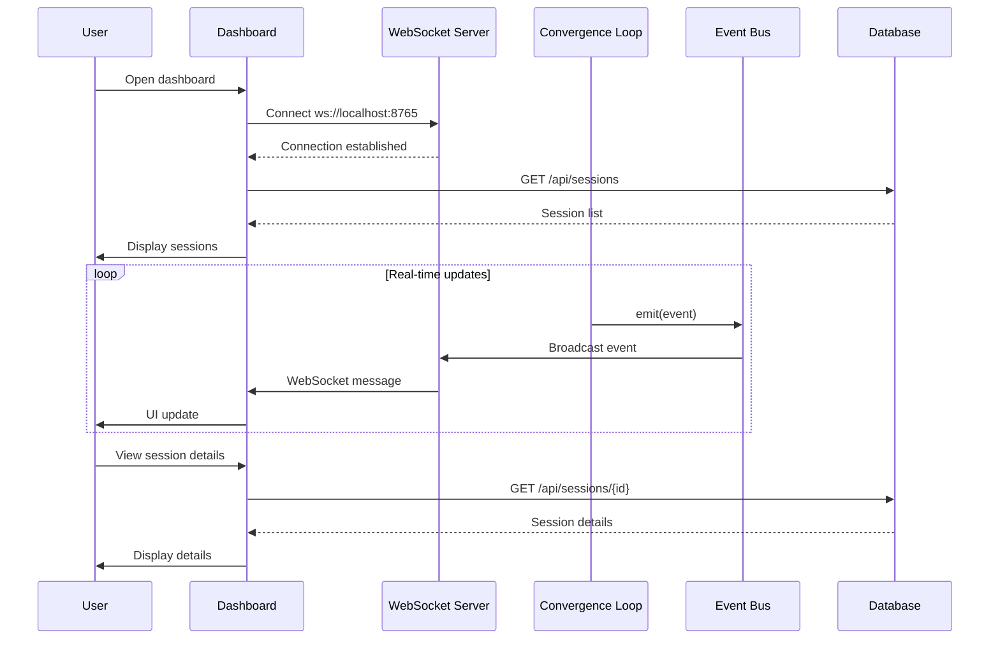
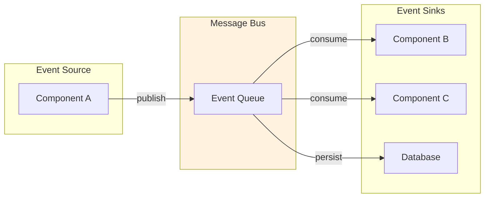
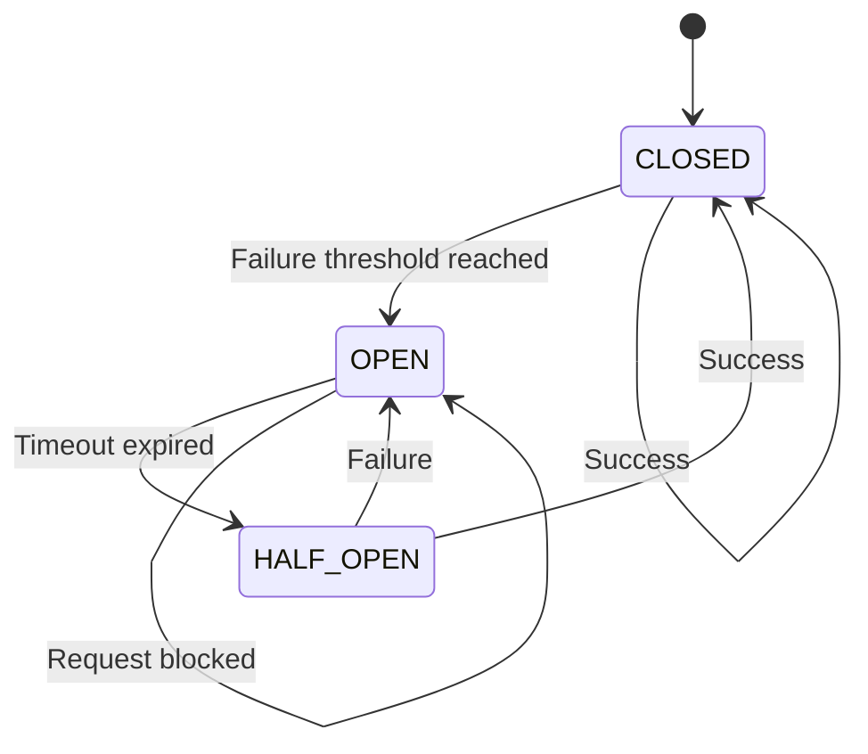
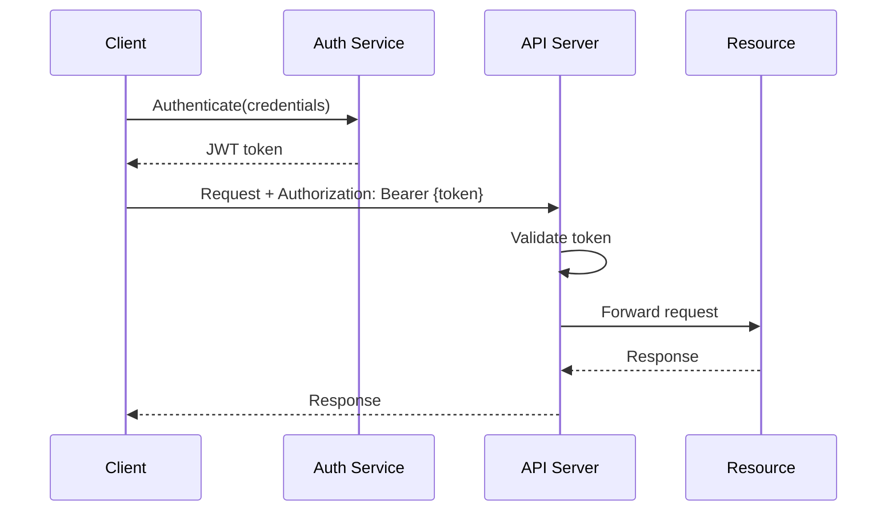

# Component Interactions

## Inter-Component Communication

### Overview

The Kimi Ecosystem components communicate through multiple channels:

1. **Direct API Calls** - Synchronous request/response
2. **Event Bus** - Asynchronous event streaming
3. **Shared Database** - Persistent state storage
4. **WebSocket** - Real-time bidirectional communication

### Communication Matrix

| From / To | Auditor | Sysadmin | Convergence | Dashboard |
|-----------|---------|----------|-------------|-----------|
| **Auditor** | - | - | API | Events |
| **Sysadmin** | - | - | API | Events |
| **Convergence** | CLI/API | CLI/API | - | WebSocket |
| **Dashboard** | - | - | WebSocket | - |

## Detailed Interaction Flows

### 1. Security Audit Flow



### 2. Safe Command Execution Flow



### 3. Convergence Loop Iteration



### 4. Dashboard Real-Time Updates



## API Integration Patterns

### REST API Pattern

```python
# Synchronous API call pattern
import httpx

async def call_auditor_api(target: str) -> ScanResult:
    async with httpx.AsyncClient() as client:
        response = await client.post(
            "http://localhost:8000/api/v1/scan",
            json={"target": target, "modules": ["sql", "cmd", "jwt"]}
        )
        return ScanResult.from_dict(response.json())
```

### Event Bus Pattern

```python
# Asynchronous event handling
from kimi_convergence_loop import EventBus, EventType

async def handle_events():
    bus = EventBus(webhook_url="http://localhost:8766/events")
    
    @bus.on(EventType.STEP_COMPLETE)
    async def on_step_complete(event):
        print(f"Step {event.data['step']} completed")
    
    await bus.start()
```

### WebSocket Pattern

```python
# Real-time bidirectional communication
import websockets
import json

async def dashboard_client():
    uri = "ws://localhost:8765"
    async with websockets.connect(uri) as ws:
        # Subscribe to events
        await ws.send(json.dumps({"action": "subscribe", "events": ["*"]}))
        
        async for message in ws:
            event = json.loads(message)
            update_ui(event)
```

## Data Synchronization

### Eventual Consistency Model



### State Reconciliation

When components need to synchronize state:

1. **Source of Truth**: SQLite database for persistent state
2. **Event Log**: Immutable event stream for replay
3. **Snapshot**: Periodic state snapshots for fast recovery

```python
# State reconciliation example
class StateReconciler:
    def __init__(self, db: Database, event_bus: EventBus):
        self.db = db
        self.event_bus = event_bus
    
    async def get_current_state(self, session_id: str) -> SessionState:
        # Get base state from database
        state = await self.db.get_session(session_id)
        
        # Replay events since last snapshot
        events = await self.event_bus.get_events_since(
            session_id, 
            state.last_event_timestamp
        )
        
        for event in events:
            state = self.apply_event(state, event)
        
        return state
```

## Error Handling

### Circuit Breaker Pattern



### Retry with Exponential Backoff

```python
import asyncio
from typing import Callable, TypeVar

T = TypeVar('T')

async def with_retry(
    fn: Callable[[], T],
    max_retries: int = 3,
    base_delay: float = 1.0
) -> T:
    for attempt in range(max_retries):
        try:
            return await fn()
        except Exception as e:
            if attempt == max_retries - 1:
                raise
            
            delay = base_delay * (2 ** attempt)
            await asyncio.sleep(delay)
```

## Security in Communication

### Authentication Flow



### mTLS for Internal Communication

```yaml
# Example configuration for mutual TLS
internal_communication:
  tls:
    enabled: true
    mode: mutual
    client_cert: /certs/client.crt
    client_key: /certs/client.key
    ca_cert: /certs/ca.crt
```
