# System Architecture Overview

## High-Level Architecture

```mermaid
flowchart TB
    subgraph User["👤 User Interface Layer"]
        CLI["Command Line Interface"]
        API["REST API"]
        DASH["Web Dashboard"]
    end

    subgraph Core["🔄 Convergence Loop Core"]
        SM["State Machine"]
        EB["Event Bus"]
        PL["Pipeline Orchestrator"]
        
        subgraph Steps["Pipeline Steps"]
            DIAG["1. Diagnose"]
            FIX["2. Fix"]
            ATT["3. Attack"]
            VAL["4. Validate"]
        end
    end

    subgraph Tools["🛠️ Security Tools"]
        AUDIT["Security Auditor"]
        ADMIN["Sysadmin AI"]
    end

    subgraph Data["💾 Data Layer"]
        DB[(SQLite/Event Store)]
        CFG[Configuration Files]
    end

    CLI --> PL
    API --> PL
    DASH --> EB
    
    PL --> SM
    PL --> EB
    SM --> Steps
    
    DIAG --> AUDIT
    FIX --> ADMIN
    ATT --> AUDIT
    VAL --> ADMIN
    
    AUDIT --> DB
    ADMIN --> DB
    EB --> DB
    
    style Core fill:#e1f5fe
    style Tools fill:#e8f5e9
    style Data fill:#fff3e0
```

## Component Architecture

### 1. Kimi Security Auditor

### 2. Kimi Sysadmin AI

```mermaid
flowchart TD
    subgraph Input["Command Input"]
        CMD["User Command"]
        CHAT["Chat Message"]
    end

    subgraph Safety["Safety Layer"]
        FILTER["Safety Filter"]
        POLICY["Policy Engine"]
        LLM["LLM Client"]
    end

    subgraph Execution["Execution Layer"]
        HOST["Host Executor"]
        DOCKER["Docker Executor"]
        K8S["Kubernetes Executor"]
    end

    CMD --> FILTER
    CHAT --> LLM
    
    FILTER --> POLICY
    POLICY -->|Allow| Execution
    POLICY -->|Deny| BLOCK["🚫 Blocked"]
    POLICY -->|Gray| CONFIRM["⚠️ Confirm"]
    
    CONFIRM -->|Approved| Execution
    
    LLM -->|Tool Call| Execution
    
    HOST --> OUT["Output"]
    DOCKER --> OUT
    K8S --> OUT

    style Safety fill:#e8f5e9
    style BLOCK fill:#ffebee
    style CONFIRM fill:#fff3e0
```

### 3. Kimi Convergence Loop

### 4. Kimi Dashboard

## Communication Patterns

### Event-Driven Architecture

### Pipeline Execution Flow

## Deployment Architecture

### Standalone Deployment

### Distributed Deployment

## Security Boundaries

## Data Model

### Core Entities

